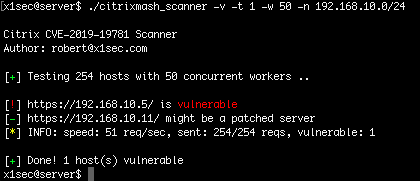

# CVE-2019-19781 citrixmash scanner

A tool to scan for Citrix appliances that are vulnerable to CVE-2019-19781.
The software specifically does not attempt to compromise/exploit hosts. Only a `HEAD` request is sent to verify if a host is vulnerable. The intended use of this software is for testing your own networks, for use in bug bounties etc.

The tool is capable of accepting a specified network range and accepting a list of target hosts specified in a text file.

Requests are concurrent with a default of 20 workers/threads. To speed up the scanning, increase workers (`-w`) or reduce the HTTP timeout (`-t`)

## Installation 
```
$ go get -u github.com/x1sec/citrixmash_scanner
```
Alternatively,  Compiled 64-bit executable files for Windows, Mac and Linux are available [here](bin/)

## Usage
```
Citrix CVE-2019-19781 Scanner

  -f string
    	File containing list of hosts
  -n string
    	Network in CIDR format (e.g. 192.168.0.0/24)
  -t int
    	HTTP timeout (seconds) (default 3)
  -v	Verbose
  -w int
    	Number of concurrent workers (default 20)
```
Note: Hosts listed in the text file referenced with the `-f` switch which do not have http or https prefixed will by default use https. Hosts can be mixed, e.g.
```
# cat targets.txt
http://target1.com
https://target2.org
192.168.0.2
http://10.0.0.4
```

### Example:
Verbose, 50 workers, 1 second timeout for each requests:

```
